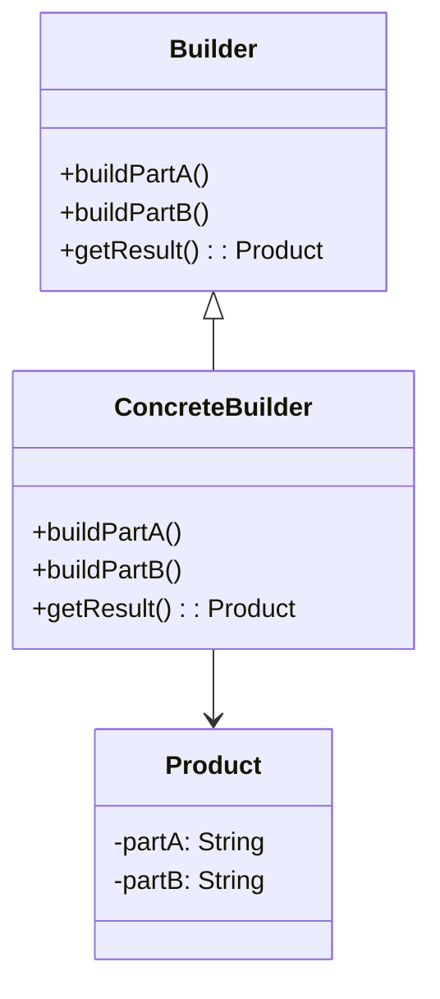
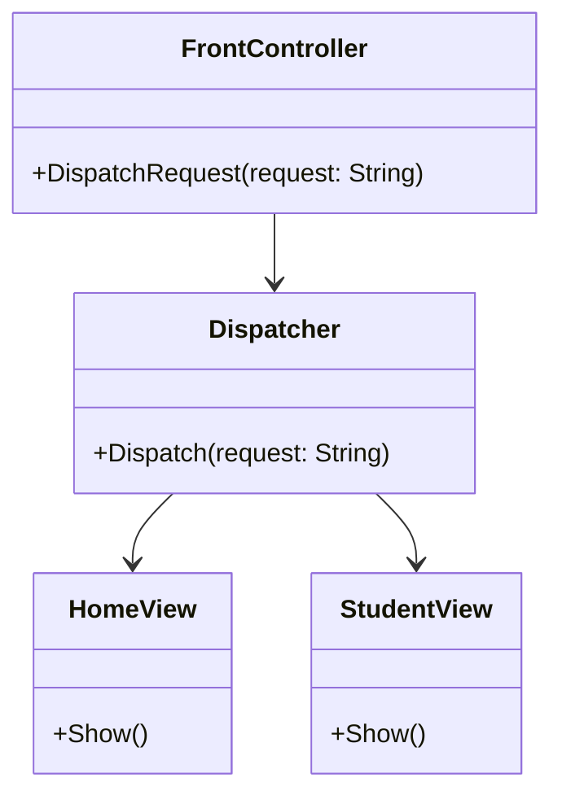
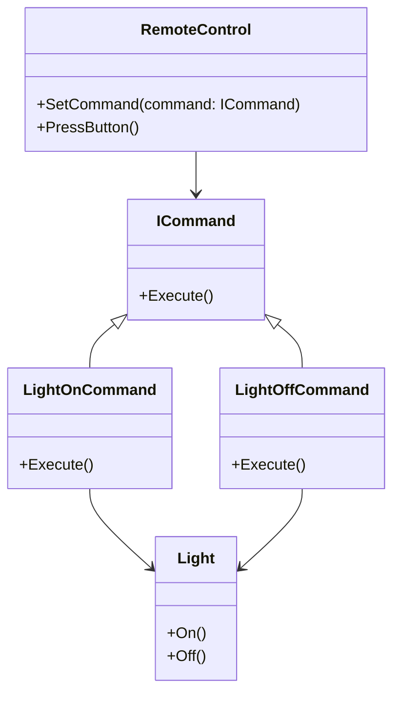
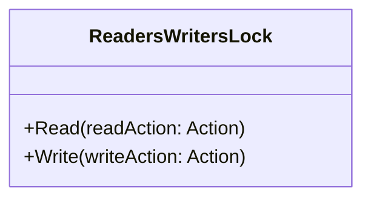

# Шаблоны проектирования

## 1. Builder
### Призначення
Шаблон Builder використовується для покрокового створення складних об'єктів.

### UML-диаграмма

## 2.Front Controller
### Призначення
Шаблон Front Controller використовується для централізованого керування обробкою запитів у веб-додатках.
### UML-диаграмма

## 3. Command
### Призначення
Шаблон "Command" перетворює запити на об'єкти, дозволяючи передавати їх як параметри методу
### UML-диаграмма

## 4. Readers-writer lock
### Призначення
Шаблон "Readers-writer lock" використовується для управління доступом до ресурсу, який може читати багато потоків одночасно, але писати в нього може тільки один потік.
### UML-диаграмма

